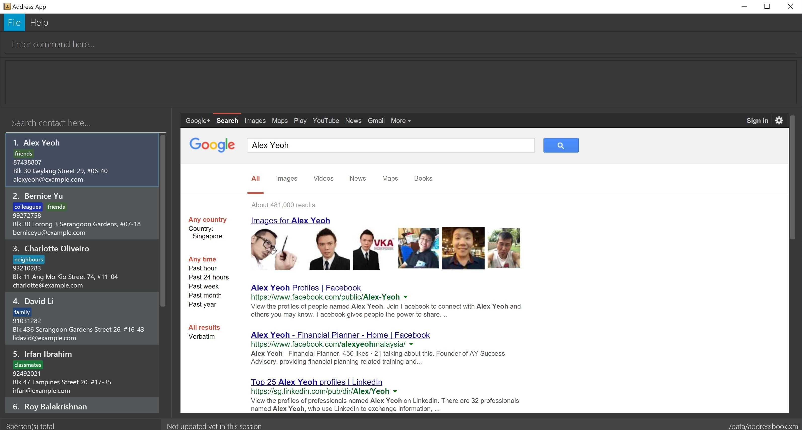

# PriorityQ

 

PriorityQ is a task manager for the modern power user who enjoys working primarily without a mouse. You care about productivity, are familiar with the command line and want to get things done swiftly.

[User Guide](docs/UserGuide.md) | [Developer Guide](docs/DeveloperGuide.md) | [About Us](docs/AboutUs.md) | [Contact Us](docs/ContactUs.md)

#### Licence : [MIT](LICENSE)
