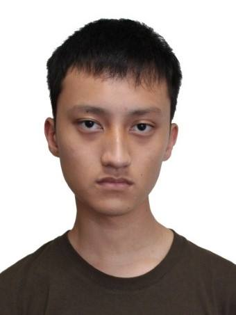

## About us

#### Le Ba Hieu Giang [@joeleba](https://github.com/joeleba)
 

* Components in charge of: [Listing](https://github.com/se-edu/addressbook-level4/blob/master/docs/DeveloperGuide.md#storage-component)
* Aspects/tools in charge of: Travis, Coveralls, Codacy
* Features implemented:
   * [Listing](https://github.com/CS2103AUG2016-W10-C2/main/blob/master/docs/UserGuide.md#listing)
   * [Input Date NLP](https://github.com/CS2103AUG2016-W10-C2/main/pull/67)
   * [Command History](https://github.com/CS2103AUG2016-W10-C2/main/issues/133)
   * [Hiding/Listing Completed Tasks](https://github.com/CS2103AUG2016-W10-C2/main/issues/115)
* Code written: [[functional code](../collated/main/A0127828W.md)][[test code](../collated/test/A0127828W.md)][[docs](../collated/docs/A0127828W.md)]
* Other major contributions:
  * Did the refactoring from AddressBook to PriorityQ ([#2](https://github.com/CS2103AUG2016-W10-C2/main/pull/2), [#142](https://github.com/CS2103AUG2016-W10-C2/main/pull/142))
  * Set up Travis, Coveralls and Codacy
  * Integration of Tokenizer ([#61](https://github.com/CS2103AUG2016-W10-C2/main/pull/61))
  * Implemented [Predicate Chaining](https://github.com/CS2103AUG2016-W10-C2/main/blob/master/src/main/java/seedu/address/model/PredicateBuilder.java) to allow better filtering with `list` command

#### Karen Ang [@karenang](https://github.com/karenang)
 

* Components in charge of: [GUI](DeveloperGuide.md#ui-component)
* Aspects/tools in charge of: Testing, [Project](https://github.com/CS2103AUG2016-W10-C2/main/projects/1)
* Features implemented:
    * GUI ([#86](https://github.com/CS2103AUG2016-W10-C2/main/pull/86), [#98](https://github.com/CS2103AUG2016-W10-C2/main/pull/98))
    * [Initial edit command](https://github.com/CS2103AUG2016-W10-C2/main/pull/23)
* Code written: [[functional code](../collated/main/A0116603R.md)][[test code](../collated/test/A0116603R.md)][[docs](../collated/docs/A0116603R.md)]
* Other major contributions:
    * Add and edit task description ([#42](https://github.com/CS2103AUG2016-W10-C2/main/pull/42), [#43](https://github.com/CS2103AUG2016-W10-C2/main/pull/43))
    * Mockups, design of app

#### Vincent Seng [@bertoia](https://github.com/bertoia)
 

* Components in charge of: [undo/redo](DeveloperGuide.md#listing-component)
* Aspects/tools in charge of: Testing
* Features implemented:
    * undo/redo command ([#73](https://github.com/CS2103AUG2016-W10-C2/main/pull/73), [#112](https://github.com/CS2103AUG2016-W10-C2/main/pull/112))
    * [mark/unmark commands](https://github.com/CS2103AUG2016-W10-C2/main/tree/mark-task)
    * [tag/untag commands](https://github.com/CS2103AUG2016-W10-C2/main/pull/41)
* Code written: [[functional code](../collated/main/A0121501E.md)][[test code](../collated/test/A0121501E.md)][[docs](../collated/docs/A0121501E.md)]
* Other major contributions:
    * [Conversion to sorted list](https://github.com/CS2103AUG2016-W10-C2/main/pull/125)

#### Tjong Anthony [@tjonganthony](https://github.com/tjonganthony)
 

* Components in charge of: Task, Event
* Aspects/tools in charge of: Models
* Features implemented:
    * [Entries type edit](https://github.com/CS2103AUG2016-W10-C2/main/pull/69)
    * [Option Command](https://github.com/CS2103AUG2016-W10-C2/main/pull/75)
* Code written: [[functional code](../collated/main/A0126539Y.md)][[test code](../collated/test/A0126539Y.md)][[docs](../collated/docs/A0126539Y.md)]
* Other major contributions:
    * [Floating Task and Deadline](https://github.com/CS2103AUG2016-W10-C2/main/pull/62)
    * [Event](https://github.com/CS2103AUG2016-W10-C2/main/pull/66)

### Roles and responsibilities
**President: Vincent**

**Testing: Karen**

**Integration: Anthony**

**Scheduling and Tracking: Joe**
