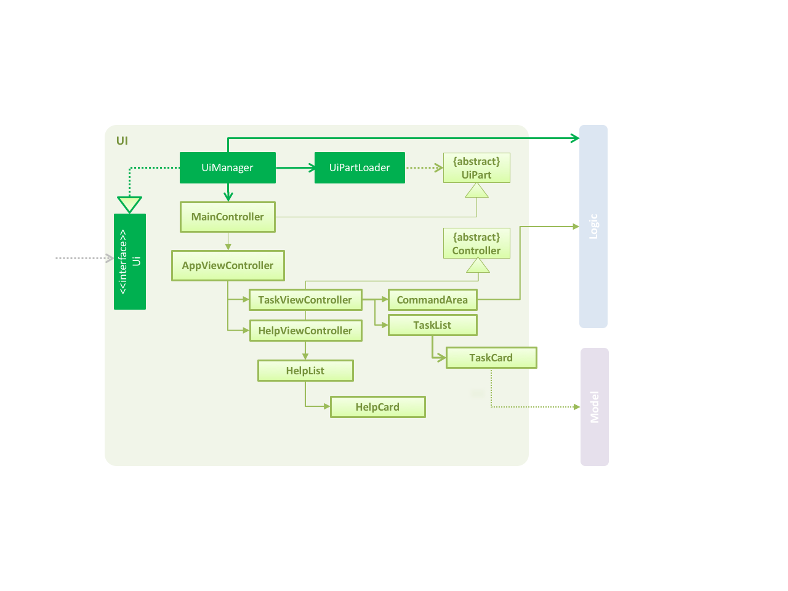
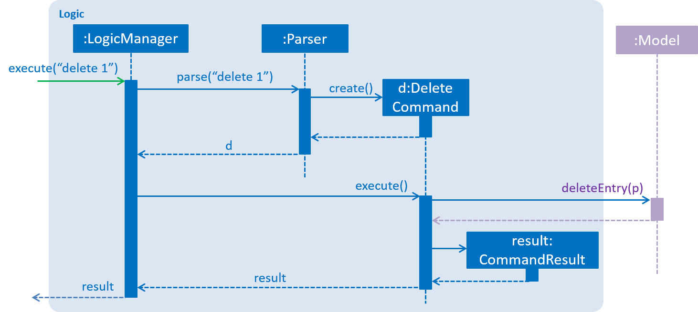
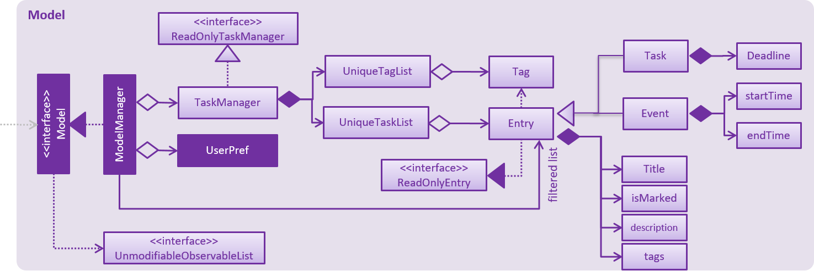
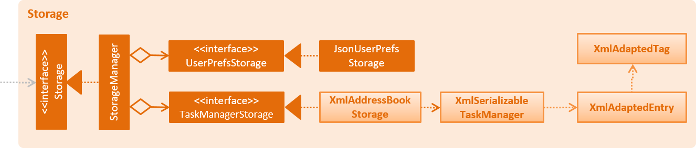

# Developer Guide

* [Setting Up](#setting-up)
* [Design](#design)
* [Implementation](#implementation)
* [Testing](#testing)
* [Dev Ops](#dev-ops)
* [Appendix A: User Stories](#appendix-a--user-stories)
* [Appendix B: Use Cases](#appendix-b--use-cases)
* [Appendix C: Non Functional Requirements](#appendix-c--non-functional-requirements)
* [Appendix D: Glossary](#appendix-d--glossary)
* [Appendix E : Product Survey](#appendix-e-product-survey)

## Setting up

#### Prerequisites

1. **JDK `1.8.0_60`**  or later 

    > Having any Java 8 version is not enough.  
    This app will not work with earlier versions of Java 8.

2. **Eclipse** IDE
3. **e(fx)clipse** plugin for Eclipse (Do the steps 2 onwards given in
   [this page](http://www.eclipse.org/efxclipse/install.html#for-the-ambitious))
4. **Buildship Gradle Integration** plugin from the Eclipse Marketplace

#### Importing the project into Eclipse

0. Fork this repo, and clone the fork to your computer
1. Open Eclipse (Note: Ensure you have installed the **e(fx)clipse** and **buildship** plugins as given
   in the prerequisites above)
2. Click `File` > `Import`
3. Click `Gradle` > `Gradle Project` > `Next` > `Next`
4. Click `Browse`, then locate the project's directory
5. Click `Finish`

  > * If you are asked whether to 'keep' or 'overwrite' config files, choose to 'keep'.
  > * Depending on your connection speed and server load, it can even take up to 30 minutes for the set up to finish
      (This is because Gradle downloads library files from servers during the project set up process)
  > * If Eclipse auto-changed any settings files during the import process, you can discard those changes.

## Design

### Architecture

 
The **_Architecture Diagram_** given above explains the high-level design of the App.
Given below is a quick overview of each component.

`Main` has only one class called [`MainApp`](../src/main/java/seedu/address/MainApp.java). It is responsible for,
* At app launch: Initializes the components in the correct sequence, and connect them up with each other.
* At shut down: Shuts down the components and invoke cleanup method where necessary.

[**`Commons`**](#common-classes) represents a collection of classes used by multiple other components.
Two of those classes play important roles at the architecture level.
* `EventsCentre` : This class (written using [Google's Event Bus library](https://github.com/google/guava/wiki/EventBusExplained))
  is used by components to communicate with other components using events (i.e. a form of _Event Driven_ design)
* `LogsCenter` : Used by many classes to write log messages to the App's log file.

The rest of the App consists four components.
* [**`UI`**](#ui-component) : The UI of tha App.
* [**`Logic`**](#logic-component) : The command executor.
* [**`Model`**](#model-component) : Holds the data of the App in-memory.
* [**`Storage`**](#storage-component) : Reads data from, and writes data to, the hard disk.

Each of the four components
* Defines its _API_ in an `interface` with the same name as the Component.
* Exposes its functionality using a `{Component Name}Manager` class.

For example, the `Logic` component (see the class diagram given below) defines it's API in the `Logic.java`
interface and exposes its functionality using the `LogicManager.java` class. 
 

The _Sequence Diagram_ below shows how the components interact for the scenario where the user issues the
command `delete 3`.

>Note how the `Model` simply raises a `AddressBookChangedEvent` when the Address Book data are changed,
 instead of asking the `Storage` to save the updates to the hard disk.

The diagram below shows how the `EventsCenter` reacts to that event, which eventually results in the updates
being saved to the hard disk and the status bar of the UI being updated to reflect the 'Last Updated' time.  

> Note how the event is propagated through the `EventsCenter` to the `Storage` and `UI` without `Model` having
  to be coupled to either of them. This is an example of how this Event Driven approach helps us reduce direct
  coupling between components.

The sections below give more details of each component.

### UI component

 

**API** : [`Ui.java`](../src/main/java/seedu/address/ui/Ui.java)

The UI consists of a `MainWindow` that is made up of parts e.g.`CommandBox`, `ResultDisplay`, `PersonListPanel`,
`StatusBarFooter`, `BrowserPanel` etc. All these, including the `MainWindow`, inherit from the abstract `UiPart` class
and they can be loaded using the `UiPartLoader`.

The `UI` component uses JavaFx UI framework. The layout of these UI parts are defined in matching `.fxml` files
 that are in the `src/main/resources/view` folder. 
 For example, the layout of the [`MainWindow`](../src/main/java/seedu/address/ui/MainWindow.java) is specified in
 [`MainWindow.fxml`](../src/main/resources/view/MainWindow.fxml)

The `UI` component,
* Executes user commands using the `Logic` component.
* Binds itself to some data in the `Model` so that the UI can auto-update when data in the `Model` change.
* Responds to events raised from various parts of the App and updates the UI accordingly.

### Logic component

 

**API** : [`Logic.java`](../src/main/java/seedu/address/logic/Logic.java)

1. `Logic` uses the `Parser` class to parse the user command.
2. This results in a `Command` object which is executed by the `LogicManager`.
3. The command execution can affect the `Model` (e.g. adding a person) and/or raise events.
4. The result of the command execution is encapsulated as a `CommandResult` object which is passed back to the `Ui`.

Given below is the Sequence Diagram for interactions within the `Logic` component for the `execute("delete 1")`
 API call. 
 

### Model component

 

**API** : [`Model.java`](../src/main/java/seedu/address/model/Model.java)

The `Model`,
* stores a `UserPref` object that represents the user's preferences.
* stores the Address Book data.
* exposes a `UnmodifiableObservableList<ReadOnlyPerson>` that can be 'observed' e.g. the UI can be bound to this list
  so that the UI automatically updates when the data in the list change.
* does not depend on any of the other three components.

### Storage component

 

**API** : [`Storage.java`](../src/main/java/seedu/address/storage/Storage.java)

The `Storage` component,
* can save `UserPref` objects in json format and read it back.
* can save the Address Book data in xml format and read it back.

### Common classes

Classes used by multiple components are in the `seedu.addressbook.commons` package.

## Implementation

### Logging

We are using `java.util.logging` package for logging. The `LogsCenter` class is used to manage the logging levels
and logging destinations.

* The logging level can be controlled using the `logLevel` setting in the configuration file
  (See [Configuration](#configuration))
* The `Logger` for a class can be obtained using `LogsCenter.getLogger(Class)` which will log messages according to
  the specified logging level
* Currently log messages are output through: `Console` and to a `.log` file.

**Logging Levels**

* `SEVERE` : Critical problem detected which may possibly cause the termination of the application
* `WARNING` : Can continue, but with caution
* `INFO` : Information showing the noteworthy actions by the App
* `FINE` : Details that is not usually noteworthy but may be useful in debugging
  e.g. print the actual list instead of just its size

### Configuration

Certain properties of the application can be controlled (e.g App name, logging level) through the configuration file
(default: `config.json`):

## Testing

Tests can be found in the `./src/test/java` folder.

**In Eclipse**:
> If you are not using a recent Eclipse version (i.e. _Neon_ or later), enable assertions in JUnit tests
  as described [here](http://stackoverflow.com/questions/2522897/eclipse-junit-ea-vm-option).

* To run all tests, right-click on the `src/test/java` folder and choose
  `Run as` > `JUnit Test`
* To run a subset of tests, you can right-click on a test package, test class, or a test and choose
  to run as a JUnit test.

**Using Gradle**:
* See [UsingGradle.md](UsingGradle.md) for how to run tests using Gradle.

We have two types of tests:

1. **GUI Tests** - These are _System Tests_ that test the entire App by simulating user actions on the GUI.
   These are in the `guitests` package.

2. **Non-GUI Tests** - These are tests not involving the GUI. They include,
   1. _Unit tests_ targeting the lowest level methods/classes.  
      e.g. `seedu.address.commons.UrlUtilTest`
   2. _Integration tests_ that are checking the integration of multiple code units
     (those code units are assumed to be working). 
      e.g. `seedu.address.storage.StorageManagerTest`
   3. Hybrids of unit and integration tests. These test are checking multiple code units as well as
      how the are connected together. 
      e.g. `seedu.address.logic.LogicManagerTest`

**Headless GUI Testing** :
Thanks to the [TestFX](https://github.com/TestFX/TestFX) library we use,
 our GUI tests can be run in the _headless_ mode.
 In the headless mode, GUI tests do not show up on the screen.
 That means the developer can do other things on the Computer while the tests are running. 
 See [UsingGradle.md](UsingGradle.md#running-tests) to learn how to run tests in headless mode.

## Dev Ops

### Build Automation

See [UsingGradle.md](UsingGradle.md) to learn how to use Gradle for build automation.

### Continuous Integration

We use [Travis CI](https://travis-ci.org/) to perform _Continuous Integration_ on our projects.
See [UsingTravis.md](UsingTravis.md) for more details.

### Making a Release

Here are the steps to create a new release.

 1. Generate a JAR file [using Gradle](UsingGradle.md#creating-the-jar-file).
 2. Tag the repo with the version number. e.g. `v0.1`
 2. [Crete a new release using GitHub](https://help.github.com/articles/creating-releases/)
    and upload the JAR file your created.

### Managing Dependencies

A project often depends on third-party libraries. For example, Address Book depends on the
[Jackson library](http://wiki.fasterxml.com/JacksonHome) for XML parsing. Managing these _dependencies_
can be automated using Gradle. For example, Gradle can download the dependencies automatically, which
is better than these alternatives. 
a. Include those libraries in the repo (this bloats the repo size) 
b. Require developers to download those libraries manually (this creates extra work for developers) 

## Appendix A : User Stories

| User Stories | Likely/Not Likely |
| ------ | ----------- |
|As a user I can add an entry by specifying a entry title only, so that I can record entrys that need to be done ‘some day’.|Likely
|As a user I can add entries that have a specific start and end time, so that I can record events with a specific duration.|Likely|
|As a user I can edit an entry, so that I can make changes to entries as needed.|Likely|
|As a user I can list all entries that are due, so that I can get an overview of all my entries.|Likely|
|As a user, I can set a entry as completed, so that I can keep track of completed/uncompleted entries.|Likely|
|As a user I can find upcoming entries, so that I can decide what needs to be done soon.|Likely|
|As a user I can delete an entry, so that I can get rid of entries that I no longer care to track.|Likely|
|As a user I can search for an entry by different entry attributes, so that I can find specific entries.|Likely|
|As a user I can undo a certain number of actions so that I can correct any mistaken actions.|Likely|
|As a new user I can view more information about a particular command, so that I can learn how to use various commands.|Likely|
|As an advanced user I can use shorter versions of a command, so that type a command faster.|Likely|
|As a user, I can add tags to the entries so that I can categorize entries together|Likely|
|As a user, I can use autocompletion of entry description so that I can quickly add entries that are similar to what I have added before|Not Likely|
|As a user, I can schedule a entry to be automatically added with a given frequency so that I don’t have to manually add entries every time.|Likely|
|As a user, I can personalize my app by changing the color scheme so that it fits my aesthetic requirements.|Not Likely|
|As an advanced user, I can specify a specific folder as the data storage location, so that I can choose to store the data file in a local folder controlled by a cloud syncing service, allowing me to access entry data from multiple computers.|Likely|
|As an advanced user, I can rebind default commands into my own keyboard shortcuts, so that I can use shortcuts that I am comfortable with.|Not Likely|
|As a user, I can choose different views of all my tasks, e.g. “Due Today”, “Due This Week”, so that I can focus on what is important to me at that moment.|Likely|
|As a user, I can type in commands in a more ‘natural’ manner, so that I do not need to learn the command format.|Not Likely|

## Appendix B : Use Cases

(For all use cases below, the **System** is the `AddressBook` and the **Actor** is the `user`, unless specified otherwise)

#### Use case: Delete person

**Use case: Create a floating task**

Actors: User

MSS

1. User request to create a new entry without specifying the start and/or end date and deadline
2. TodoList add that particular floating task into database and save it

  Use Case Ends

**Use case: Create an event**

Actors: User

MSS

1. User request to create a new entry while specifying the start and/or end date but not deadline
2. TodoList add that particular floating task into database and save it

  Use Case Ends

**Use Case: Create a deadline**

Actors: User

MSS

1. User request to create a new entry while specifying the deadline but no start and/or end date
2. TodoList add that particular deadline into database and save it

  Use Case Ends

**Use Case: Delete an entry**

Actors: User

MSS

1. User requests to delete an entry with a specified id
2. TodoList deletes the entry

  Use Case Ends

*Extensions*

1a. Entry with the specified id does not exist
> 1a1. TodoList warns the user the entry with the specified id does not exist
>
> Use Case Ends

**Use Case: List all entries**

Actors: User

MSS

1. User requests to list all entries
2. TodoList shows a list of entries, sorted by date (oldest first)

  Use Case Ends

**Use Case: List entries with filters**

Actors: User

MSS

1. User requests to list entries with some filters
2. TodoList shows a list of entries that satisfies the filters, sorted by date (oldest first)

  Use Case Ends

**Use Case: Add tags to a list of entries**

Actors: User

MSS

1. User requests to list a filtered list of entries
2. User requests to add tags to the listed entries

  Use Case Ends

*Extensions*

2a. User attempts to add an invalid tag
>2a1. TodoList tells the user that the tag name is invalid
>
>Use Case Ends

## Appendix C : Non Functional Requirements

1. User should navigate the application primarily using the command line
2. Should be easy to navigate through large numbers of tasks and events
3. Should not have a response time more than 100ms
4. Should have minimal data loss after an unexpected crash
5. Should have consistent data
6. Should be able to accommodate more than 1000 tasks and events
7. Should be able to work offline
8. Should not exceed 100MB of RAM when in use
9. Should store data as files instead of in some relational database
10. Storage file should be human-editable and human-readable

## Appendix D : Glossary

##### Mainstream OS

> Windows, Linux, Unix, OS-X

##### Private contact detail

> A contact detail that is not meant to be shared with others

## Appendix E : Product Survey

### Trello:

Strengths:

- Geared towards task management: focus on only 1 thing
- Covers various aspects of task management: deadline, assignees, descriptions, discussions
- Designed to be collaborative
- Unique UI, which gives a great overview of the tasks
- Cross-platform

Weaknesses:

- Missing ability to schedule recurring tasks
- Poor integration with calendar
- A bit cluttered for personal use, since it’s designed for collaborative work

### Evernote:

Strengths:

- All-in-one swiss army knife: Not only task management, can keep notes as well
- Good in capturing tasks that need to be done before a specific date/time, or after a specific date/time, and items without specific times.
- Can access tasks online and offline (if Jim is willing to pay for Evernote premium)

Weaknesses:

- Needs a few clicks/keyboard shortcuts to add a new task
- No way to “block” some time out except by explicitly writing it in a note.

### Google Keep:

Strengths:

- Compact UI that allows for many tasks to be viewed at once.
- Colored tasks as visual aid.
- Checkbox to indicate task completion. Alternatively, tasks can be archived to indicate completion.
- Supports dynamic content such as links, images and drawings.
- Sync through multiple gadget.

Weakness:

- No options for viewing the list of tasks in different orders (most recent, deadline etc)
- No calendar view.

