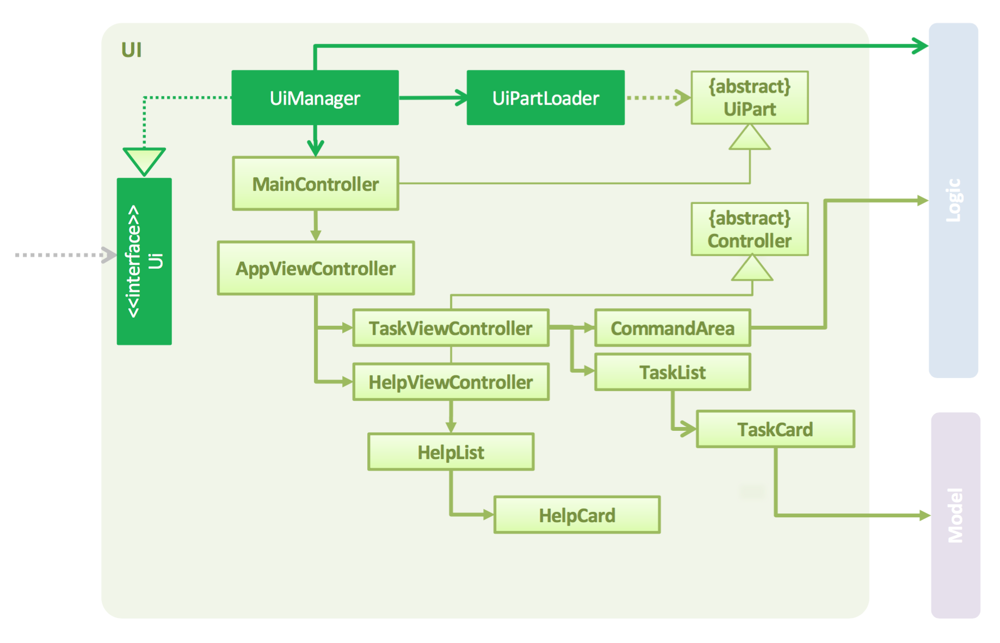

<!-- @@author A0127828W -->
# Developer Guide

* [Setting Up](#setting-up)
* [Design](#design)
* [Implementation](#implementation)
* [Testing](#testing)
* [Dev Ops](#dev-ops)
* [Appendix A: User Stories](#appendix-a--user-stories)
* [Appendix B: Use Cases](#appendix-b--use-cases)
* [Appendix C: Non Functional Requirements](#appendix-c--non-functional-requirements)
* [Appendix D: Glossary](#appendix-d--glossary)
* [Appendix E : Product Survey](#appendix-e-product-survey)

## Introduction

Welcome to PriorityQ’s developer guide! PriorityQ is a task manager for the modern power user who enjoys working primarily with the keyboard.

This guide aims to help you get familiarised with PriorityQ’s design so that you can extend or contribute to it. We also provide specifications on the development environment and testing.

## Setting up

#### Prerequisites

1. **JDK `1.8.0_60`**  or later<br>

    > Having any Java 8 version is not enough. <br>
    This app will not work with earlier versions of Java 8.

2. **Eclipse** IDE
3. **e(fx)clipse** plugin for Eclipse (Do the steps 2 onwards given in
   [this page](http://www.eclipse.org/efxclipse/install.html#for-the-ambitious))
4. **Buildship Gradle Integration** plugin from the Eclipse Marketplace


#### Importing the project into Eclipse

0. Fork this repo, and clone the fork to your computer
1. Open Eclipse (Note: Ensure you have installed the **e(fx)clipse** and **buildship** plugins as given
   in the prerequisites above)
2. Click `File` > `Import`
3. Click `Gradle` > `Gradle Project` > `Next` > `Next`
4. Click `Browse`, then locate the project's directory
5. Click `Finish`

  > * If you are asked whether to 'keep' or 'overwrite' config files, choose to 'keep'.
  > * Depending on your connection speed and server load, it can even take up to 30 minutes for the set up to finish
      (This is because Gradle downloads library files from servers during the project set up process)
  > * If Eclipse auto-changed any settings files during the import process, you can discard those changes.

## Design

### Architecture

<br>

The architecture diagram given above explains the high-level design of PriorityQ. Given below is a quick overview of each component.


`Main` has only one class called [`MainApp`](../src/main/java/seedu/priorityq/MainApp.java).

* At app launch: It is responsible for initialising the components in the correct sequence, as well as linking them up.
* At app exit: It is responsible for shutting down each component and invoking any clean-up methods.

[**`Commons`**](#common-classes) represents a collection of classes used by multiple other components.
Two of those classes play important roles at the architecture level.
* `EventsCentre` : This class (written using [Google's Event Bus library](https://github.com/google/guava/wiki/EventBusExplained))
  is used by components to communicate with other components using events (i.e. a form of _Event Driven_ design)
* `LogsCenter` : Used by many classes to write log messages to the App's log file.

The rest of PriorityQ consists four components.
* [**`UI`**](#ui-component) :  Displays GUI(Graphical User Interface) to user.
* [**`Logic`**](#logic-component) : The command executor.
* [**`Model`**](#model-component) : Represents actual data in the program.
* [**`EventsCenter`**]() : Handles callbacks for event that’s happening from the model changing.
* [**`Storage`**](#storage-component) : Reads data from, and writes data to, the hard disk.

Our architecture follows the _MVC Pattern_: UI displays data and interacts with the user; Logic listens to events from UI, and acts as the bridge between UI and Model; Model & Storage stores and maintain the data.

### Components

<!-- @@author A0116603R -->
#### User Interface (UI)

<br>

**API** : [`Ui.java`](../src/main/java/seedu/priorityq/ui/Ui.java)

The `view` component is the part of the application that directly interacts with the user. The `view` is created using information supplied from the controller. Thus, a major purpose of view objects is to display data from the application’s model objects and to enable the editing of that data.

To accomplish this, the `view` component communicates all user interactions through the `controller` component to the application’s `model` objects. In turn, any changes in `model` data are propagated through the application’s `controller` objects.

The diagram above gives an overview of the architecture of the `UI` component of PriorityQ. The `UI` consists of a `MainController` which encapsulates the root layout of the GUI. The `MainController` inherits from the abstract `UiPart` class and it can be loaded using the `UiPartLoader`. On start-up, the `MainController` initialises an `AppViewController`.

Subsequently, the `AppViewController` initialises the `TaskViewController` and the `HelpViewController`. The former is made up of a `TaskList` which displays `TaskCard`s, while the latter is made up of a `HelpList` which displays `HelpCard`s. Both of them implement the abstract `Controller` class which enforces the implementation of certain methods for initialisation and also provides common and useful controller methods needed by all such view controllers.

To display custom layouts to the user, the `UI` component uses JavaFx `UI` framework. The root layout is a `StackPane` from JavaFX.

`UI` parts are defined in matching `.fxml` files that are in the `src/main/resources/view` folder. For example, the root layout is specified in [`RootLayout.fxml`](../src/main/resources/view/RootLayout.fxml), and the `TaskList` is specified in [`TaskList.fxml`](../src/main/resources/view/TaskList.fxml).

PriorityQ has its own custom stylesheet which makes the GUI clean and simple. You can find the [css stylesheet](../src/main/resources/view/PriorityQTheme.css) in the same folder as the `.fxml` files.

In summary, the UI component:

- Executes user commands using the Logic component.
- Binds itself to data in the Model so that the UI can auto-update when data in the Model changes.
- Responds to events raised from various parts of the App and updates the UI accordingly.
- Raises events for certain user-initiated interactions so that other UI components can respond accordingly.

<!-- @@author A0127828W -->
#### Logic

<br>

**API** : [`Logic.java`](../src/main/java/seedu/address/logic/Logic.java)

The `Logic` component acts as an intermediary between the view and any model/storage objects. `Logic` objects are thus a channel through which view components learn about changes in model objects and vice versa. Logic objects also handle the coordination of tasks in the system.


In PriorityQ, a logic object interprets user actions made in view objects, such as entering a command, and communicates these information to the model layer. When model objects change, a controller object relays these changes to the view objects so that they can display it to the users.


All valid user input are parsed into `Command` objects. Each command has a separate class (e.g. `AddCommand`, `ListCommand`, …), and all of them implement the `Command` interface. The interface acts as an abstraction layer so that Logic does not need to know the implementation details of each `Command` class, and makes sure that every command class follows the same architecture. The individual details of each command (command keywords, valid format, …) are defined in each `Command` class.


The parsing of user commands is done by `Parser`. `Parser` is invoked every time a command is entered. It first confirms that the given command is of the correct format. The command string is then passed to the individual parser of each command to return the appropriate Command object.


After that, the `Command` objects are executed by `LogicManager`. `LogicManager` implements the `Logic` interface, which also acts as an abstraction layer to other components of PriorityQ. `LogicManager` will call the execute method to execute the `Commands` objects. The result of the command execution is encapsulated as a `CommandResult` object which is passed back to the UI. This follows the _Command Pattern_: `LogicManager` executes commands without having to know the specific command type.


`Command` execution can affect the `Model` and `Storage` (e.g. adding an entry) and/or raise events.

Given below is the Sequence Diagram for interactions within the `Logic` component for the `execute("delete 1")`
 API call.<br>

<br>

`ArgumentTokenizer` is a utility class which is used by Parser when parsing the user input. It allows more flexibility by tokenizing command parameters, so that no specific order has to be pre-defined.

<!-- @@author A0121501E -->

##### Undoable Command History

The command history component facilitates the use of the undo and redo commands. It consists of two stacks, namely the `UndoableHistoryStack` and `RedoableHistoryStack`. Whenever an undoable command is successfully executed, the command is added to the `UndoableHistoryStack`. Every one of these undoable commands contains states and instructions that allows the changes made by the command to be undone.


When the user uses the undo command, the most recent undoable command is popped from the `UndoableHistoryStack` and the command’s `unexecute()` method is called, which reverses the changes made by the command. If the undo command is successful, the command’s state is now redoable and will be added into the `RedoableHistoryStack`.


Similarly, when the redo command is executed, the most recently added redoable command is popped from the `RedoableHistoryStack` and the `reExecute()` method is called. if the redo command is successful, the command is now undoable and it will be added back into the `UndoableHistoryStack`.


Whenever the user executes a new undoable command, the `RedoableHistoryStack` is refreshed which removes all redoable commands. This is to keep the history consistent which is similar to  how page navigation works in web browsers.  The `UndoableHistoryStack` holds a maximum of 20 undoable commands to guard against memory leak.

<!-- @@author A0126539Y -->
#### Model and Event

<br>

**API** : [`Model.java`](../src/main/java/seedu/address/model/Model.java)

A model object encapsulates data that pertains to a particular application. For example, we have model objects which will represent tasks and events in the context of a to-do manager. In PriorityQ, a `TaskList` has many `Entries` which can be either a `Task` or `Event`. In addition, PriorityQ also keeps a list of Tags that are used to tag entries. These objects temporarily keep track of data which will ultimately be persisted through the `Storage` class. PriorityQ makes use of a text file in .xml format to persist user data. This data will then be loaded into the application when PriorityQ is first launched. Conversely, when any changes are made to the model object, the xml file will be updated to reflect these changes.


Since PriorityQ follows an MVC framework, user actions in the view layer are propagated to the model via the `Logic` component, which acts as a controller object. When a user creates a new task in PriorityQ, a `Task` model object is created. In PriorityQ, event-based programming is made use of via the `EventsCenter`. For example, model changes which might involve updating of other objects will be transmitted by informing the EventsCenter of a new event.

<br>

<!-- @@author A0116603R -->
Certain GUI interactions are propagated to the logic component using the `EventsCenter`:

<br>

<!-- @@author A0126539Y -->
The `list` command supports filtering entries by multiple conditions (e.g. title, tags, due date). `PredicateBuilder` is a class in `Model` that chains these predicates to allow the combination of multiple search conditions. It follows the _Singleton Pattern_: `PredicateBuilder` has a private constructor, a static instance and a public `getInstance` method to access this only instance.

#### Storage

<br>

**API** : [`Storage.java`](../src/main/java/seedu/address/storage/Storage.java)

The storage component encapsulate the need of handling data read and write by any other component. The storage component also provide a facade that covers several storage such as the user preference storage and the task manager storage itself. By doing so, other component just need to interact with the facade storage and not the user preference storage or the task manager storage directly which may add complexity. The storage class itself is flexible as we can change our type of storage, such as Xml to Json easily without changing the whole component.


#### Common classes

Classes used by multiple components are in the `seedu.addressbook.commons` package.
ju
#### Program workflow

This section gives an overview of PriorityQ’s program flow. PriorityQ uses the Model View Controller paradigm. It is a simple, yet reliable and commonly used method for structuring applications. It also suits the design need of our system. The flow of the program would look like this:

<br>

## Implementation

### Logging

We are using `java.util.logging` package for logging. The `LogsCenter` class is used to manage the logging levels
and logging destinations.

* The logging level can be controlled using the `logLevel` setting in the configuration file
  (See [Configuration](#configuration))
* The `Logger` for a class can be obtained using `LogsCenter.getLogger(Class)` which will log messages according to
  the specified logging level
* Currently log messages are output through: `Console` and to a `.log` file.

**Logging Levels**

* `SEVERE` : Critical problem detected which may possibly cause the termination of the application
* `WARNING` : Can continue, but with caution
* `INFO` : Information showing the noteworthy actions by the App
* `FINE` : Details that is not usually noteworthy but may be useful in debugging
  e.g. print the actual list instead of just its size

### Configuration

Certain properties of the application can be controlled (e.g App name, logging level) through the configuration file
(default: `config.json`):

## Testing

Tests can be found in the `./src/test/java` folder.

**In Eclipse**:
> If you are not using a recent Eclipse version (i.e. _Neon_ or later), enable assertions in JUnit tests
  as described [here](http://stackoverflow.com/questions/2522897/eclipse-junit-ea-vm-option).

* To run all tests, right-click on the `src/test/java` folder and choose
  `Run as` > `JUnit Test`
* To run a subset of tests, you can right-click on a test package, test class, or a test and choose
  to run as a JUnit test.

**Using Gradle**:
* See [UsingGradle.md](UsingGradle.md) for how to run tests using Gradle.

We have two types of tests:

1. **GUI Tests** - These are _System Tests_ that test the entire App by simulating user actions on the GUI.
   These are in the `guitests` package.

2. **Non-GUI Tests** - These are tests not involving the GUI. They include,
   1. _Unit tests_ targeting the lowest level methods/classes. <br>
      e.g. `seedu.priorityq.commons.UrlUtilTest`
   2. _Integration tests_ that are checking the integration of multiple code units
     (those code units are assumed to be working).<br>
      e.g. `seedu.priorityq.storage.StorageManagerTest`
   3. Hybrids of unit and integration tests. These test are checking multiple code units as well as
      how the are connected together.<br>
      e.g. `seedu.priorityq.logic.LogicManagerTest`

**Headless GUI Testing** :
Thanks to the [TestFX](https://github.com/TestFX/TestFX) library we use,
 our GUI tests can be run in the _headless_ mode.
 In the headless mode, GUI tests do not show up on the screen.
 That means the developer can do other things on the Computer while the tests are running.<br>
 See [UsingGradle.md](UsingGradle.md#running-tests) to learn how to run tests in headless mode.

## Dev Ops

### Build Automation

See [UsingGradle.md](UsingGradle.md) to learn how to use Gradle for build automation.

<!-- @@author A0116603R -->
### Continuous Integration

We use [Travis CI](https://travis-ci.org/) to perform _Continuous Integration_ on our projects.
See [UsingTravis.md](UsingTravis.md) for more details.

### Making a Release

Here are the steps to create a new release.

 1. Generate a JAR file [using Gradle](UsingGradle.md#creating-the-jar-file).
 2. Tag the repo with the version number. e.g. `v0.1`
 2. [Crete a new release using GitHub](https://help.github.com/articles/creating-releases/)
    and upload the JAR file your created.

### Managing Dependencies

A project often depends on third-party libraries. For example, Address Book depends on the
[Jackson library](http://wiki.fasterxml.com/JacksonHome) for XML parsing. Managing these _dependencies_
can be automated using Gradle. For example, Gradle can download the dependencies automatically, which
is better than these alternatives.<br>
a. Include those libraries in the repo (this bloats the repo size)<br>
b. Require developers to download those libraries manually (this creates extra work for developers)<br>

## Known Issues

### Natural language processing for recurring events
The natural language processing for recurring events has a few bugs. Currently, the recurrence feature can only handle user input with the format: “every X <unit of time>”, i.e: “every 1 day”. This restricts the user’s freedom in typing in a command to create a recurring event.

### Performance

The program will take longer to respond if a large number (e.g. a few thousand) of tasks are present in PriorityQ. A workaround is to regularly clear your completed tasks by using either the delete  or  clear  command.


## Future work

### Google Calendar integration

Google Calendar offers a comprehensive user experience when it comes to organizing tasks on a calendar. Other features like email reminders, invitations and especially cross-platform synchronization can greatly benefit our users.

### Personalization

We want users to have their own personal touch in the app. Hence we’re looking forward to implement some features that users can customise such as changing theme color to suit user’s style. We will provide 10+ themes for use to select and modify to help make PriorityQ their own.

### Email notification
Although this is not a main feature since we designed PriorityQ to be able to work 100% offline, it would be a nice-to-have.

## Appendix A : User Stories

| User Stories | Likely/Not Likely |
| ------ | ----------- |
|As a user I can add an entry by specifying a entry title only, so that I can record entrys that need to be done ‘some day’.|Likely
|As a user I can add entries that have a specific start and end time, so that I can record events with a specific duration.|Likely|
|As a user I can add descriptions to my entries, so that I can add detail to my tasks.|Likely|
|As a user I can edit an entry, so that I can make changes to entries as needed.|Likely|
|As a user I can delete an entry, so that I can get rid of entries that I no longer care to track.|Likely|
|As a user I can list all entries that are due, so that I can get an overview of all my entries.|Likely|
|As a user I can find upcoming entries, so that I can decide what needs to be done soon.|Likely|
|As a user, I can set a entry as completed, so that I can keep track of completed/uncompleted entries.|Likely|
|As a user, I can add tags to the entries so that I can categorize entries together|Likely|
|As a user I can search for an entry by different entry attributes, so that I can find specific entries.|Likely|
|As a user I can undo a certain number of actions so that I can correct any mistaken actions.|Likely|
|As a new user I can view more information about a particular command, so that I can learn how to use various commands.|Likely|
|As an advanced user I can use shorter versions of a command, so that type a command faster.|Likely|
|As a user, I can schedule a entry to be automatically added with a given frequency so that I don’t have to manually add entries every time.|Likely|
|As an advanced user, I can specify a specific folder as the data storage location, so that I can choose to store the data file in a local folder controlled by a cloud syncing service, allowing me to access entry data from multiple computers.|Likely|
|As a user, I can choose different views of all my tasks, e.g. “Due Today”, “Due This Week”, so that I can focus on what is important to me at that moment.|Likely|
|As a user, I can use autocompletion of entry description so that I can quickly add entries that are similar to what I have added before|Not Likely|
|As a user, I can personalize my app by changing the color scheme so that it fits my aesthetic requirements.|Not Likely|
|As an advanced user, I can rebind default commands into my own keyboard shortcuts, so that I can use shortcuts that I am comfortable with.|Not Likely|
|As a user, I can type in commands in a more ‘natural’ manner, so that I do not need to learn the command format.|Not Likely|

## Appendix B : Use Cases

(For all use cases below, the **System** is the `TaskManager` and the **Actor** is the `user`, unless specified otherwise)

#### Use case: Delete entry

**Use case: Create a floating task**

Actors: User

MSS

1. User request to create a new entry without specifying the start and/or end date and deadline
2. TodoList add that particular floating task into Storage and save it

  Use Case Ends

*Extensions*

1a. Entry is entered with invalid properties e.g. title
> 1a1. TodoList warns user that the entry is invalid and does not add it into Storage
>
> Use Case Ends

1b. Entry already exists
> 1b1. TodoList warns user that the entry already exists and does not add it into Storage
>
> Use Case Ends

**Use case: Create an event**

Actors: User

MSS

1. User request to create a new entry while specifying the start and/or end date but not deadline
2. TodoList add that particular event into Storage and save it

  Use Case Ends

**Use Case: Create a deadline**

Actors: User

MSS

1. User request to create a new entry while specifying the deadline but no start and/or end date
2. TodoList add that particular deadline into Storage and save it

  Use Case Ends

**Use Case: Delete an entry**

Actors: User

MSS

1. User requests to delete an entry with a specified id
2. TodoList deletes the entry

  Use Case Ends

*Extensions*

1a. Entry with the specified id does not exist
> 1a1. TodoList warns the user that the entry with the specified id does not exist
>
> Use Case Ends

<!-- @@author A0121501E -->
**Use Case: List all entries**

Actors: User

MSS

1. User requests to list all entries
2. TodoList shows a list of entries, sorted by date (oldest first)

  Use Case Ends

**Use Case: List entries with filters**

Actors: User

MSS

1. User requests to list entries with some filters
2. TodoList shows a list of entries that satisfies the filters, sorted by date (oldest first)

  Use Case Ends

**Use Case: Add tags to a list of entries**

Actors: User

MSS

1. User requests to list a filtered list of entries
2. User requests to add tags to the listed entries

  Use Case Ends

*Extensions*

2a. User attempts to add an invalid tag
>2a1. TodoList tells the user that the tag name is invalid
>
>Use Case Ends

## Appendix C : Non Functional Requirements

1. User should navigate the application primarily using the command line
2. Should be easy to navigate through large numbers of tasks and events
3. Should not have a response time more than 100ms
4. Should have minimal data loss after an unexpected crash
5. Should have consistent data
6. Should be able to accommodate more than 1000 tasks and events
7. Should be able to work offline
8. Should not exceed 100MB of RAM when in use
9. Should store data as files instead of in some relational database
10. Storage file should be human-editable and human-readable


## Appendix D : Glossary

##### Mainstream OS

> Windows, Linux, Unix, OS-X


## Appendix E : Product Survey

### Trello:

Strengths:

- Geared towards task management: focus on only 1 thing
- Covers various aspects of task management: deadline, assignees, descriptions, discussions
- Designed to be collaborative
- Unique UI, which gives a great overview of the tasks
- Cross-platform

Weaknesses:

- Missing ability to schedule recurring tasks
- Poor integration with calendar
- A bit cluttered for personal use, since it’s designed for collaborative work

### Evernote:

Strengths:

- All-in-one swiss army knife: Not only task management, can keep notes as well
- Good in capturing tasks that need to be done before a specific date/time, or after a specific date/time, and items without specific times.
- Can access tasks online and offline (if Jim is willing to pay for Evernote premium)

Weaknesses:

- Needs a few clicks/keyboard shortcuts to add a new task
- No way to “block” some time out except by explicitly writing it in a note.

### Google Keep:

Strengths:

- Compact UI that allows for many tasks to be viewed at once.
- Colored tasks as visual aid.
- Checkbox to indicate task completion. Alternatively, tasks can be archived to indicate completion.
- Supports dynamic content such as links, images and drawings.
- Sync through multiple gadget.

Weakness:

- No options for viewing the list of tasks in different orders (most recent, deadline etc)
- No calendar view.


## Appendix F: Data Storage XML Example
```xml
<?xml version="1.0" ?>
<taskmanager>
  <entries>
    <title>Swim 1 laps</title>
    <description>Or just sleep...</description>
    <end>2016-11-01T09:00</end>
    <tagged>Healthy</tagged>
    <isMarked>true</isMarked>
    <lastModified>2016-11-01T09:00</lastModified>
    <recursion>0</recursion>
  </entries>
  <entries>
    <title>Buy 1 apple</title>
    <tagged>NTUC</tagged>
    <tagged>fresh</tagged>
    <isMarked>true</isMarked>
    <lastModified>2016-11-01T09:00</lastModified>
    <recursion>0</recursion>
  </entries>
  <entries>
    <title>Work on CS4224</title>
    <start>2016-11-01T18:00</start>
    <end>2016-11-01T22:00</end>
    <tagged>pain</tagged>
    <isMarked>true</isMarked>
    <lastModified>2016-11-01T09:00</lastModified>
    <recursion>0</recursion>
  </entries>
  <entries>
    <title>Swim 2 laps</title>
    <description>Or just sleep...</description>
    <end>2016-11-02T09:00</end>
    <tagged>Healthy</tagged>
    <isMarked>true</isMarked>
    <lastModified>2016-11-02T09:00</lastModified>
    <recursion>0</recursion>
  </entries>
  <entries>
    <title>Buy 2 banana</title>
    <tagged>NTUC</tagged>
    <tagged>fresh</tagged>
    <isMarked>true</isMarked>
    <lastModified>2016-11-02T09:00</lastModified>
    <recursion>0</recursion>
  </entries>
  <entries>
    <title>Work on CS2103T</title>
    <start>2016-11-02T18:00</start>
    <end>2016-11-02T22:00</end>
    <tagged>pain</tagged>
    <isMarked>true</isMarked>
    <lastModified>2016-11-02T09:00</lastModified>
    <recursion>0</recursion>
  </entries>
  <entries>
    <title>Run 3 rounds</title>
    <description>Or just sleep...</description>
    <end>2016-11-03T09:00</end>
    <tagged>Healthy</tagged>
    <isMarked>true</isMarked>
    <lastModified>2016-11-03T09:00</lastModified>
    <recursion>0</recursion>
  </entries>
  <entries>
    <title>Buy 3 banana</title>
    <tagged>NTUC</tagged>
    <tagged>fresh</tagged>
    <isMarked>true</isMarked>
    <lastModified>2016-11-03T09:00</lastModified>
    <recursion>0</recursion>
  </entries>
  <entries>
    <title>Work on CS4224</title>
    <start>2016-11-03T18:00</start>
    <end>2016-11-03T22:00</end>
    <tagged>pain</tagged>
    <isMarked>true</isMarked>
    <lastModified>2016-11-03T09:00</lastModified>
    <recursion>0</recursion>
  </entries>
  <entries>
    <title>Run 4 rounds</title>
    <description>Or just sleep...</description>
    <end>2016-11-04T09:00</end>
    <tagged>Healthy</tagged>
    <isMarked>true</isMarked>
    <lastModified>2016-11-04T09:00</lastModified>
    <recursion>0</recursion>
  </entries>
  <entries>
    <title>Buy 4 pineapple</title>
    <tagged>NTUC</tagged>
    <tagged>fresh</tagged>
    <isMarked>true</isMarked>
    <lastModified>2016-11-04T09:00</lastModified>
    <recursion>0</recursion>
  </entries>
  <entries>
    <title>Work on CS2103T</title>
    <start>2016-11-04T18:00</start>
    <end>2016-11-04T22:00</end>
    <tagged>pain</tagged>
    <isMarked>true</isMarked>
    <lastModified>2016-11-04T09:00</lastModified>
    <recursion>0</recursion>
  </entries>
  <entries>
    <title>Swim 5 laps</title>
    <description>Or just sleep...</description>
    <end>2016-11-05T09:00</end>
    <tagged>Healthy</tagged>
    <isMarked>true</isMarked>
    <lastModified>2016-11-05T09:00</lastModified>
    <recursion>0</recursion>
  </entries>
  <entries>
    <title>Buy 5 grapes</title>
    <tagged>NTUC</tagged>
    <tagged>fresh</tagged>
    <isMarked>true</isMarked>
    <lastModified>2016-11-05T09:00</lastModified>
    <recursion>0</recursion>
  </entries>
  <entries>
    <title>Work on CS2105</title>
    <start>2016-11-05T18:00</start>
    <end>2016-11-05T22:00</end>
    <tagged>pain</tagged>
    <isMarked>true</isMarked>
    <lastModified>2016-11-05T09:00</lastModified>
    <recursion>0</recursion>
  </entries>
  <entries>
    <title>Swim 6 laps</title>
    <description>Or just sleep...</description>
    <end>2016-11-06T09:00</end>
    <tagged>Healthy</tagged>
    <isMarked>false</isMarked>
    <lastModified>2016-11-06T09:00</lastModified>
    <recursion>0</recursion>
  </entries>
  <entries>
    <title>Buy 6 apple</title>
    <tagged>NTUC</tagged>
    <tagged>fresh</tagged>
    <isMarked>false</isMarked>
    <lastModified>2016-11-06T09:00</lastModified>
    <recursion>0</recursion>
  </entries>
  <entries>
    <title>Work on CS2101</title>
    <start>2016-11-06T18:00</start>
    <end>2016-11-06T22:00</end>
    <tagged>pain</tagged>
    <isMarked>false</isMarked>
    <lastModified>2016-11-06T09:00</lastModified>
    <recursion>0</recursion>
  </entries>
  <entries>
    <title>Swim 7 laps</title>
    <description>Or just sleep...</description>
    <end>2016-11-07T09:00</end>
    <tagged>Healthy</tagged>
    <isMarked>false</isMarked>
    <lastModified>2016-11-07T09:00</lastModified>
    <recursion>0</recursion>
  </entries>
  <entries>
    <title>Buy 7 banana</title>
    <tagged>NTUC</tagged>
    <tagged>fresh</tagged>
    <isMarked>false</isMarked>
    <lastModified>2016-11-07T09:00</lastModified>
    <recursion>0</recursion>
  </entries>
  <entries>
    <title>Work on CS2101</title>
    <start>2016-11-07T18:00</start>
    <end>2016-11-07T22:00</end>
    <tagged>pain</tagged>
    <isMarked>false</isMarked>
    <lastModified>2016-11-07T09:00</lastModified>
    <recursion>0</recursion>
  </entries>
  <entries>
    <title>Do 8 push ups</title>
    <description>Or just sleep...</description>
    <end>2016-11-08T09:00</end>
    <tagged>Healthy</tagged>
    <isMarked>false</isMarked>
    <lastModified>2016-11-08T09:00</lastModified>
    <recursion>0</recursion>
  </entries>
  <entries>
    <title>Buy 8 banana</title>
    <tagged>NTUC</tagged>
    <tagged>fresh</tagged>
    <isMarked>false</isMarked>
    <lastModified>2016-11-08T09:00</lastModified>
    <recursion>0</recursion>
  </entries>
  <entries>
    <title>Work on CS4224</title>
    <start>2016-11-08T18:00</start>
    <end>2016-11-08T22:00</end>
    <tagged>pain</tagged>
    <isMarked>false</isMarked>
    <lastModified>2016-11-08T09:00</lastModified>
    <recursion>0</recursion>
  </entries>
  <entries>
    <title>Swim 9 laps</title>
    <description>Or just sleep...</description>
    <end>2016-11-09T09:00</end>
    <tagged>Healthy</tagged>
    <isMarked>false</isMarked>
    <lastModified>2016-11-09T09:00</lastModified>
    <recursion>0</recursion>
  </entries>
  <entries>
    <title>Buy 9 banana</title>
    <tagged>NTUC</tagged>
    <tagged>fresh</tagged>
    <isMarked>false</isMarked>
    <lastModified>2016-11-09T09:00</lastModified>
    <recursion>0</recursion>
  </entries>
  <entries>
    <title>Work on CS2101</title>
    <start>2016-11-09T18:00</start>
    <end>2016-11-09T22:00</end>
    <tagged>pain</tagged>
    <isMarked>false</isMarked>
    <lastModified>2016-11-09T09:00</lastModified>
    <recursion>0</recursion>
  </entries>
  <entries>
    <title>Do 10 push ups</title>
    <description>Or just sleep...</description>
    <end>2016-11-10T09:00</end>
    <tagged>Healthy</tagged>
    <isMarked>false</isMarked>
    <lastModified>2016-11-10T09:00</lastModified>
    <recursion>0</recursion>
  </entries>
  <entries>
    <title>Buy 10 apple</title>
    <tagged>NTUC</tagged>
    <tagged>fresh</tagged>
    <isMarked>false</isMarked>
    <lastModified>2016-11-10T09:00</lastModified>
    <recursion>0</recursion>
  </entries>
  <entries>
    <title>Work on CS4224</title>
    <start>2016-11-10T18:00</start>
    <end>2016-11-10T22:00</end>
    <tagged>pain</tagged>
    <isMarked>false</isMarked>
    <lastModified>2016-11-10T09:00</lastModified>
    <recursion>0</recursion>
  </entries>
  <entries>
    <title>Do 11 push ups</title>
    <description>Or just sleep...</description>
    <end>2016-11-11T09:00</end>
    <tagged>Healthy</tagged>
    <isMarked>false</isMarked>
    <lastModified>2016-11-11T09:00</lastModified>
    <recursion>0</recursion>
  </entries>
  <entries>
    <title>Buy 11 grapes</title>
    <tagged>NTUC</tagged>
    <tagged>fresh</tagged>
    <isMarked>false</isMarked>
    <lastModified>2016-11-11T09:00</lastModified>
    <recursion>0</recursion>
  </entries>
  <entries>
    <title>Work on CS2103T</title>
    <start>2016-11-11T18:00</start>
    <end>2016-11-11T22:00</end>
    <tagged>pain</tagged>
    <isMarked>false</isMarked>
    <lastModified>2016-11-11T09:00</lastModified>
    <recursion>0</recursion>
  </entries>
  <entries>
    <title>Do 12 push ups</title>
    <description>Or just sleep...</description>
    <end>2016-11-12T09:00</end>
    <tagged>Healthy</tagged>
    <isMarked>false</isMarked>
    <lastModified>2016-11-12T09:00</lastModified>
    <recursion>0</recursion>
  </entries>
  <entries>
    <title>Buy 12 grapes</title>
    <tagged>NTUC</tagged>
    <tagged>fresh</tagged>
    <isMarked>false</isMarked>
    <lastModified>2016-11-12T09:00</lastModified>
    <recursion>0</recursion>
  </entries>
  <entries>
    <title>Work on CS2105</title>
    <start>2016-11-12T18:00</start>
    <end>2016-11-12T22:00</end>
    <tagged>pain</tagged>
    <isMarked>false</isMarked>
    <lastModified>2016-11-12T09:00</lastModified>
    <recursion>0</recursion>
  </entries>
  <entries>
    <title>Swim 13 laps</title>
    <description>Or just sleep...</description>
    <end>2016-11-13T09:00</end>
    <tagged>Healthy</tagged>
    <isMarked>false</isMarked>
    <lastModified>2016-11-13T09:00</lastModified>
    <recursion>0</recursion>
  </entries>
  <entries>
    <title>Buy 13 grapes</title>
    <tagged>NTUC</tagged>
    <tagged>fresh</tagged>
    <isMarked>false</isMarked>
    <lastModified>2016-11-13T09:00</lastModified>
    <recursion>0</recursion>
  </entries>
  <entries>
    <title>Work on CS2101</title>
    <start>2016-11-13T18:00</start>
    <end>2016-11-13T22:00</end>
    <tagged>pain</tagged>
    <isMarked>false</isMarked>
    <lastModified>2016-11-13T09:00</lastModified>
    <recursion>0</recursion>
  </entries>
  <entries>
    <title>Run 14 rounds</title>
    <description>Or just sleep...</description>
    <end>2016-11-14T09:00</end>
    <tagged>Healthy</tagged>
    <isMarked>false</isMarked>
    <lastModified>2016-11-14T09:00</lastModified>
    <recursion>0</recursion>
  </entries>
  <entries>
    <title>Buy 14 pineapple</title>
    <tagged>NTUC</tagged>
    <tagged>fresh</tagged>
    <isMarked>false</isMarked>
    <lastModified>2016-11-14T09:00</lastModified>
    <recursion>0</recursion>
  </entries>
  <entries>
    <title>Work on CS2105</title>
    <start>2016-11-14T18:00</start>
    <end>2016-11-14T22:00</end>
    <tagged>pain</tagged>
    <isMarked>false</isMarked>
    <lastModified>2016-11-14T09:00</lastModified>
    <recursion>0</recursion>
  </entries>
  <entries>
    <title>Swim 15 laps</title>
    <description>Or just sleep...</description>
    <end>2016-11-15T09:00</end>
    <tagged>Healthy</tagged>
    <isMarked>false</isMarked>
    <lastModified>2016-11-15T09:00</lastModified>
    <recursion>0</recursion>
  </entries>
  <entries>
    <title>Buy 15 pineapple</title>
    <tagged>NTUC</tagged>
    <tagged>fresh</tagged>
    <isMarked>false</isMarked>
    <lastModified>2016-11-15T09:00</lastModified>
    <recursion>0</recursion>
  </entries>
  <entries>
    <title>Work on CS2101</title>
    <start>2016-11-15T18:00</start>
    <end>2016-11-15T22:00</end>
    <tagged>pain</tagged>
    <isMarked>false</isMarked>
    <lastModified>2016-11-15T09:00</lastModified>
    <recursion>0</recursion>
  </entries>
  <entries>
    <title>Swim 16 laps</title>
    <description>Or just sleep...</description>
    <end>2016-11-16T09:00</end>
    <tagged>Healthy</tagged>
    <isMarked>false</isMarked>
    <lastModified>2016-11-16T09:00</lastModified>
    <recursion>0</recursion>
  </entries>
  <entries>
    <title>Buy 16 apple</title>
    <tagged>NTUC</tagged>
    <tagged>fresh</tagged>
    <isMarked>false</isMarked>
    <lastModified>2016-11-16T09:00</lastModified>
    <recursion>0</recursion>
  </entries>
  <entries>
    <title>Work on CS2105</title>
    <start>2016-11-16T18:00</start>
    <end>2016-11-16T22:00</end>
    <tagged>pain</tagged>
    <isMarked>false</isMarked>
    <lastModified>2016-11-16T09:00</lastModified>
    <recursion>0</recursion>
  </entries>
  <entries>
    <title>Run 17 rounds</title>
    <description>Or just sleep...</description>
    <end>2016-11-17T09:00</end>
    <tagged>Healthy</tagged>
    <isMarked>false</isMarked>
    <lastModified>2016-11-17T09:00</lastModified>
    <recursion>0</recursion>
  </entries>
  <entries>
    <title>Buy 17 banana</title>
    <tagged>NTUC</tagged>
    <tagged>fresh</tagged>
    <isMarked>false</isMarked>
    <lastModified>2016-11-17T09:00</lastModified>
    <recursion>0</recursion>
  </entries>
  <entries>
    <title>Work on CS2103T</title>
    <start>2016-11-17T18:00</start>
    <end>2016-11-17T22:00</end>
    <tagged>pain</tagged>
    <isMarked>false</isMarked>
    <lastModified>2016-11-17T09:00</lastModified>
    <recursion>0</recursion>
  </entries>
</taskmanager>
```
