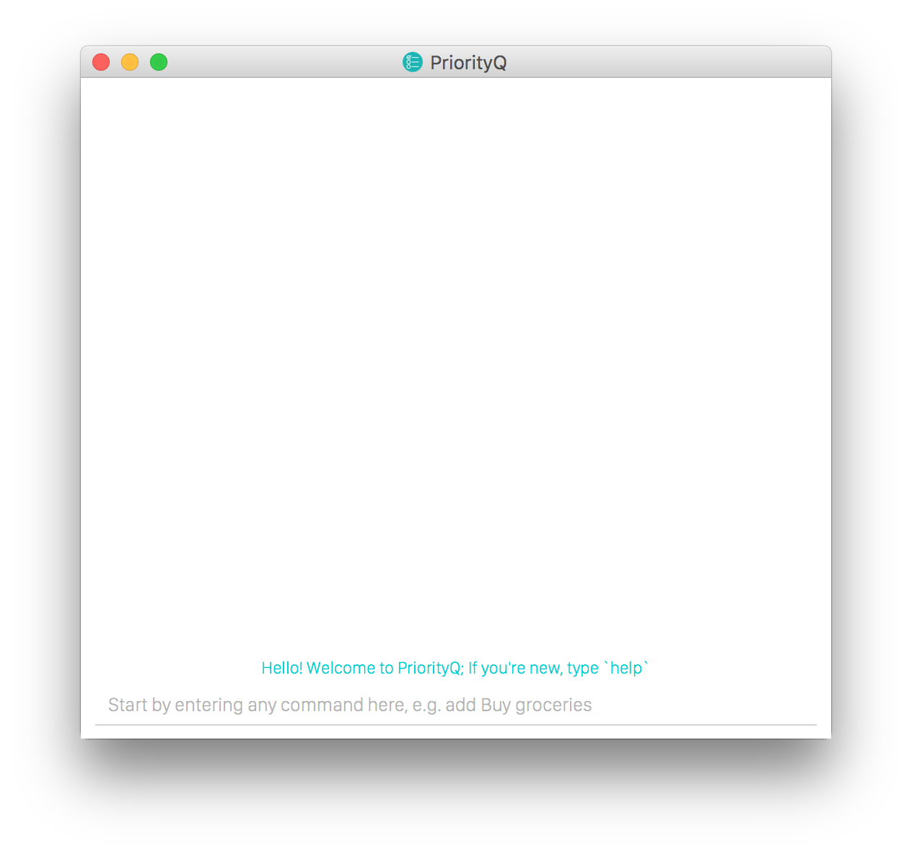
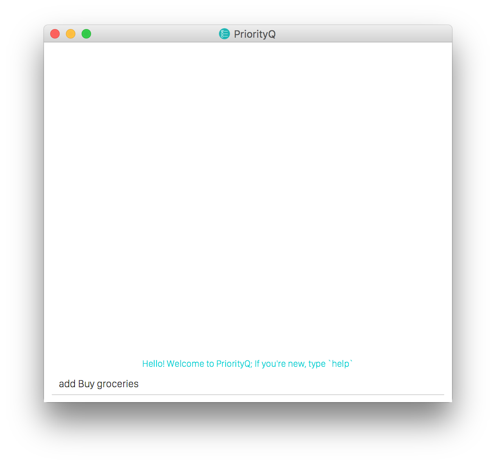
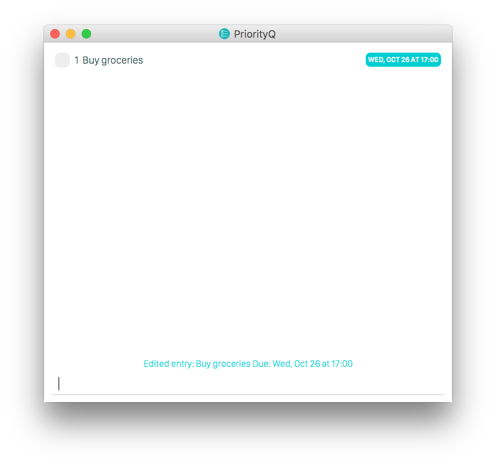
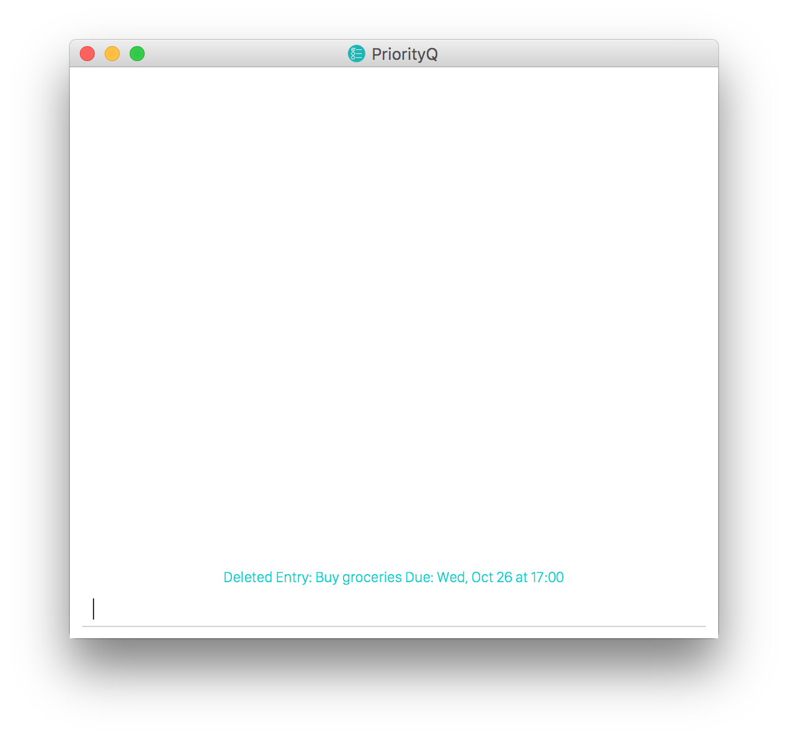

User guide
===================

## Getting Started

<br>

Our to-do application primarily takes in input using a command line interface. It supports the basic creation, reading, updating and deletion of entries. You may add entries with or without deadlines. These are known as tasks. Entries with a start and/or end time are known as events.

To start, try adding a new task:

```
add Buy groceries
```


You can edit a task with the following command:

```
edit 0 end/tomorrow 5pm
```
Yep, natural language is parsed as well!



Undo is quite easily done:

```
$ undo

$ list
[ ] Get groceries
```

Finally, try deleting the task:

```
delete 1
```




## Command Summary

| Command |Format |
| --- | --- |
|add|`add <task_name> [start/<start> end/<end>] [#<tag_name> ...]  [r/<recurrence>] [desc/<description>]`|
|list|`list [[keywords] [[after/<date>] [before/<date>] | [on/<date>]][#<tag_name> ...] [recurrence=<recurrence_value>] [desc=<description_value>]]`| [type/{entry, task}]
|tag|`tag <task_id> #<tag_name> [#<tag_name> ...]`|
|untag|`untag <task_id> #<tag_name> [#<tag_name> ...]`|
|edit|`edit <task_id> [title/new title] [start/<start> end/<end>] [#<tags>...] [r/ <recurrence>] [desc/<description>]`|
|delete|`delete <task_id>`|
|mark|`mark <task_id>`|
|unmark|`unmark <task_id>`|
|help|`help [<command>]`|
|option|`option [<type>/<value> ...]`|

## Commands

#### Adding
```
add <task_name> [start/<start> end/<end>] [#<tag_name> ...]  [r/<recurrence>] [desc/<description>]
```

Add event or deadline

Examples:


- `add CS2103T Lecture start/2016-10-10 10:00 end/2016-10-10 12:00 r/weekly #rocks`

- `add CS2105 Assignment 1 end/2016-10-10 10:00`

#### Listing
```
list [[keywords] [[after/<date>] [before/<date>] | [on/<date>]] [#<tag_name> ...] [recurrence=<recurrence_value>] [desc=<description_value>]] [type/{entry, task}]
```

List all entries, or entries that satisfy the given search criteria. For the best user experience, completed entries are _automatically excluded_.

Examples:

- `list`

- `list after/2016-10-10`

- `list buy banana #groceries`

If you want to include completed entries in your search, replace `list` with `list-all`

- `list-all buy banana`

#### Tagging
```
tag <task_id> #<tag_name> [#<tag_name>...]
```

Add tag(s) to a particular entry with a specified id

Examples:

- `tag 123 #CS2103T #rocks`

Delete tag(s) from a particular entry with a specified id using `untag`

- `untag 123 #rocks`

Duplicated tags will only be added once

#### Editing
```
edit <task_id> [title/new title] [start/<start> end/<end>] [#<tags>...] [r/ <recurrence>] [desc/<description>]
```

 Edit the entry with the specified entry id.

 `list` should be executed before this command to obtain a entry id.

Examples:

- `edit 3 school`

- `edit 13 #yearly`


#### Deleting
```
delete <entry_id>
```
Delete the task with a particular entry id

`list` should be executed before this command to obtain a entry id.

Examples:

- `Delete 42`

#### Marking
```
mark <entry_id>
```

Check (or uncheck, for `unmark`) a entry as completed.

`list` should be executed before this command to obtain a entry id.

Examples:

- `mark 42`

- `unmark 42`

#### Help
```
help [<command>]
```

Show available commands and how to use them

Help is also shown if you enter an incorrect command e.g. abcd

#### option
```
option [<type>/<value> ...]
```
Configure user settings: name, file path to data file

Examples:

- `config save/data/MyNewLocation.xml`

#### Misc

You can use UP and DOWN keys to browse through your past commands in the session.
